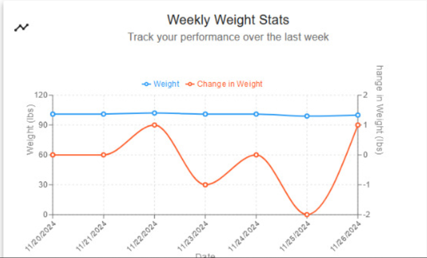
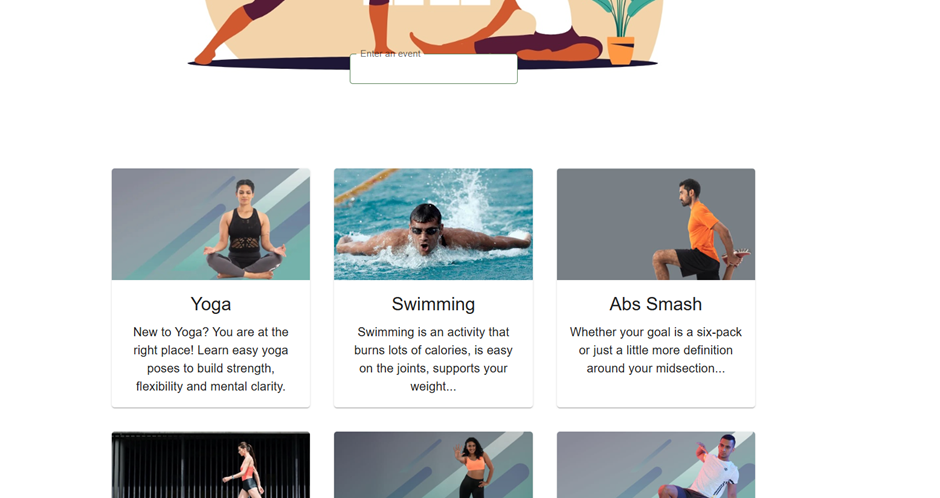
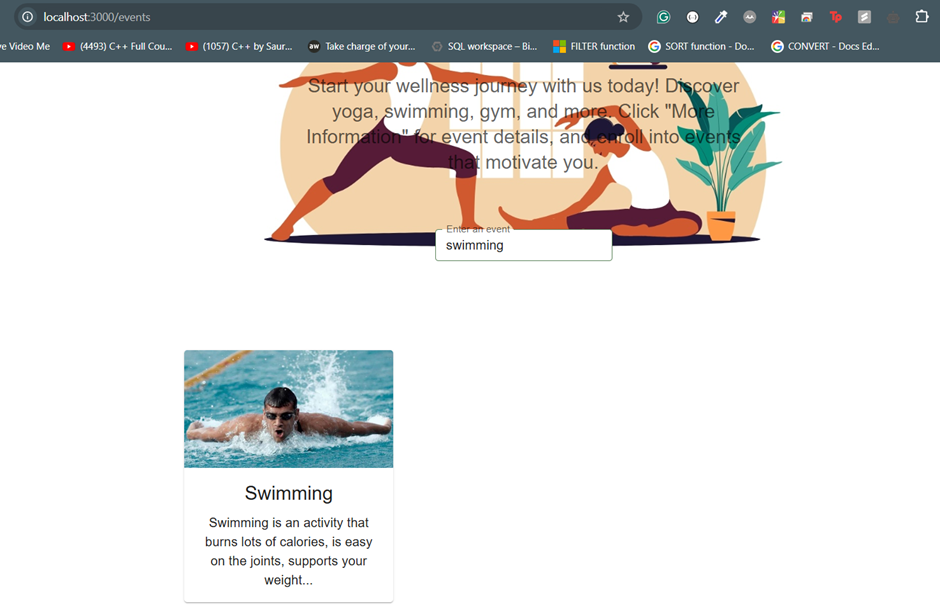
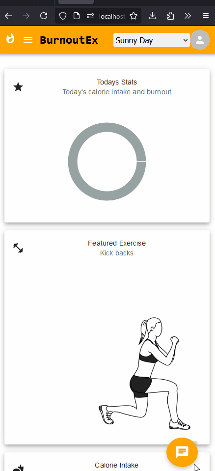

<br />

<div  align="center">
  <a href="https://github.com/othneildrew/Best-README-Template">
    
  </a>
  <h3 align="center">BurnoutExtreme</h3>
  <p align="center">
    Your ultimate health and wellness companion 🏃‍♀️💪
    <br />
    A holistic platform to help you manage fitness, diet, and health goals, built on the success of the original Burnout project.
    <br />
    <a href="https://github.com/SoftwareEngineeringNCSU101/BurnoutExtreme/blob/master/backend/html/backend/index.html"><strong>Explore the API docs »</strong></a>
    <br />
    <br />
    <a href="https://youtu.be/xQB6AbBLLWU?si=4RX05gmUf6D-M-7v">View Demo</a>
    <!-- <a href="https://github.com/Software-Engineering-2024-Group/BurnoutExtreme/blob/master/Tutorials.md">View Detail Demo</a> -->
    <!-- ·
    <a href="https://github.com/Software-Engineering-2024-Group/BurnoutExtreme?tab=readme-ov-file#-score-card">Scores</a> -->
    ·
    <a href="https://github.com/SoftwareEngineeringNCSU101/BurnoutExtreme/blob/master/Developer_README.md">Developer Documentation</a>
  </p>
</div>
<br>

[](https://github.com/SoftwareEngineeringNCSU101/BurnoutExtreme/blob/master/LICENSE)
[](https://doi.org/10.5281/zenodo.14020325)
[](https://www.python.org/)
[](https://github.com/SoftwareEngineeringNCSU101/BurnoutExtreme/actions/workflows/unit_test.yml)
[](https://github.com/SoftwareEngineeringNCSU101/BurnoutExtreme/actions/workflows/autopep8.yml)
[](https://www.python.org/dev/peps/pep-0008/)
[](https://github.com/SoftwareEngineeringNCSU101/BurnoutExtreme/actions/workflows/flake8.yml)
[](https://github.com/SoftwareEngineeringNCSU101/BurnoutExtreme)
[](https://github.com/SoftwareEngineeringNCSU101/BurnoutExtreme/issues?q=is%3Aopen+is%3Aissue)
[](https://github.com/SoftwareEngineeringNCSU101/BurnoutExtreme/issues?q=is%3Aissue+is%3Aclosed)
[](https://github.com/SoftwareEngineeringNCSU101/BurnoutExtreme/pulls?q=is%3Apr+is%3Aclosed)
[](https://github.com/SoftwareEngineeringNCSU101/BurnoutExtreme/graphs/contributors)
[](https://github.com/Software-Engineering-2024-Group/BurnoutExtreme/network/members) 
[](https://github.com/Software-Engineering-2024-Group/BurnoutExtreme/stargazers)

<!--  -->

---
### Team 74
#### Members
* Dinesh Kannan
* Harshvardhan Patil
* Sakshi Phatak

# Table of Contents

- [What's new?](#whats-new)
- [Why Choose BurnoutExtreme?](#-why-choose-burnoutextreme)
- [Walkthrough](#walkthrough)
- [Application Screenshots:](#application-screenshots)
  - [Sign In](#sign-in)
  - [Homepage](#homepage)
  - [Profile](#profile)
  - [Events](#events)
  - [My Meals](#my-meals)
  - [My Workouts](#my-workouts)
  - [FAQs](#faqs)
  - [Contact Us](#contact-us)
- [Project Techstack:](#project-techstack)
- <a href="https://github.com/aditikilledar/burnout-proj3/blob/main/README.md#getting-started"> Get Started: Installation </a>
- [Bug Fixes](#bug-fixes)
- [Future Enhancements](#future-enhancements)
- [Contributors](#contributors)
- [Contribution](#contribution)
- [License](#license)

---
## **🔥 BurnoutExtreme: More Power, More Progress, More You! 🔥**

Are you determined to achieve your dream physique? Desiring to take charge of your health? Looking for a platform that offers everything from calorie counting to enrolling in exciting fitness events? Welcome to **BurnoutExtreme** – the only health and fitness companion you'll ever need.

---
## 💡 Why Choose BurnoutExtreme?

- **📊 Comprehensive Tracking**: From what you eat to how much you burn, monitor everything in one place. Our app integrates **diet tracking** and **activity tracking**, allowing you to see a complete picture of your health journey.

- **🔍 Personalized Recommendations**: Receive customized health tips and recommendations tailored to your unique health data.

- **🗺️ Diverse Fitness Events**: Never fall into the monotony of routine. Stay excited about fitness with new events to join regularly. Discover local fitness meet-ups and classes using Google Maps integration.

- **🏋️ Custom Workout Plans**: Tailor your fitness experience with personalized workout routines that match your preferences and goals. Create your custom workouts and track your progress to achieve the results you desire.

- **📈 Real-Time Progress Tracking**: Monitor your journey with real-time updates on your calorie intake and activity levels. Celebrate milestones as you see your improvements firsthand, helping you stay committed to your goals.

- **🧘 Mental Wellness Support**: Balance physical fitness with mental wellness tracking and tips.

- **🌟 Community Support**: Engage with a like-minded community, exchange tips, and stay motivated. Share your experiences, challenges, and triumphs with others who understand your journey.

- **🔒 Data Security**: Your data is precious, and we guard it like our own. Rest assured, your information stays private and secure.

- **📍 Event Mapping**: Our Google Maps integration enhances your experience by providing detailed information about fitness events. Find nearby activities, view routes, and explore new locations, making every event an adventure.

---
## 🌟 Key Features

- **🤖 Implementation of ChatBot**
Receive personalized meal and workout recommendations from an intelligent chatbot, tailored to your preferences, goals, and health data, making it easier to stay on track with your wellness journey.

- **📱 Mobile Support**
Enjoy a fully optimized interface that adapts seamlessly to all devices, ensuring a smooth user experience whether you're on a smartphone, tablet, or desktop.

- **🍽️ Meal Categorization**
Meals are automatically categorized into breakfast, lunch, and dinner, streamlining meal planning and calorie tracking, making it quicker and more intuitive for users to stay on top of their nutrition.

- **🪟 Sorting & Filtering Capabilities**
Easily sort and filter meal and workout suggestions based on your health data, ensuring personalized and balanced recommendations that align with your specific health goals.

- **📊 Weekly Weight Tracking**
Track your weight weekly, with visual progress reports highlighting changes, so you can monitor your gradual weight loss journey and make informed decisions for continued success.

- **🍎 Nutrition Made Simple:**
  Navigating the complex world of nutrition can be daunting. With BurnoutExtreme, you can effortlessly track what you eat and gain insights into your calorie consumption. Whether you're having a quick salad or indulging in a cheat meal, every bite counts. And we're here to count it for you!

- **🔥 Ignite Your Calorie Burn:**
  Exercise isn't just about looking good; it's about feeling good too. Track every step taken, every calorie burned, and every drop of sweat shed. Watch yourself progress as BurnoutExtreme pushes you to achieve your health goals.

- **🏋️ Custom Workouts, Your Way:** 
  Build and personalize your own workout routines. Choose exercises, set durations, and craft the ideal workout for you. With BurnoutExtreme, your fitness plan is in your hands.

- **🚶 Activity Tracking Feature:** 
  Monitor your daily activity by tracking the number of steps taken and calculating the calories burned throughout the week. Stay accountable and motivated as you see your activity levels improve day by day.

- **🍽️ Diet Tracking Feature:** 
  Easily record the calories consumed through your daily meals. This feature allows you to see how much you’ve eaten and how many calories you need to burn to reach your goals. Keep your nutrition on track with insights tailored to your dietary habits.

- **🏊 Dive into Exciting Fitness Events:**
  Bored of your routine workout? Dive into an array of fitness events – from calming yoga sessions to adrenaline-pumping gym workouts. Whether you're into swimming, walking, or exploring new activities, there's something for everyone. Get social, challenge yourself, and discover activities you love.

- **📊 Tailored To You:**
  Everyone's health journey is unique. Input your age, current weight, height, target weight, and goals, and let BurnoutExtreme craft a personalized plan for you. Watch in real-time as you inch closer to your goals and celebrate each milestone with us.

So, are you ready to take the leap towards a healthier, happier you? Dive into **BurnoutExtreme** now and elevate your fitness game!

🔥 _Because it's not just about burning calories; it's about burning doubts, burning procrastination, and lighting up confidence!_ 🔥
---

## What existed 
As version i-1, forked this repo from this [link](https://github.com/Software-Engineering-2024-Group/BurnoutExtreme)

- **🗺️ Google Maps Integration for Events**  
  Easily find and join local fitness events in your area. Discover meet-ups, classes, and other events happening near you with integrated Google Maps functionality.

- **🎨 Personalized Themes**  
  Customize BurnoutExtreme with a variety of themes, including dark mode, minimalist, or vibrant options to match your personal style.

- **🏋️‍♂️ Custom Workout Plans**  
  Personalize your fitness journey with custom workout routines tailored to your goals. Includes a built-in calendar to keep you on schedule and motivated.

- **🍲 Enhanced Diet Tracker**  
  Track your nutrition more effectively! Our improved diet tracker records the calorie count of each ingredient in your meals, helping you stay within daily goals.

- **📈 Advanced Activity Monitoring**  
  Track real-time data on steps, calories burned, and workout intensity, providing deep insights to keep you motivated.

- **🍎 Nutrition Made Simple:**
  Navigating the complex world of nutrition can be daunting. With BurnoutExtreme, you can effortlessly track what you eat and gain insights into your calorie consumption. Whether you're having a quick salad or indulging in a cheat meal, every bite counts. And we're here to count it for you!

- **🔥 Ignite Your Calorie Burn:**
  Exercise isn't just about looking good; it's about feeling good too. Track every step taken, every calorie burned, and every drop of sweat shed. Watch yourself progress as BurnoutExtreme pushes you to achieve your health goals.

- **🏋️ Custom Workouts, Your Way:** 
  Build and personalize your own workout routines. Choose exercises, set durations, and craft the ideal workout for you. With BurnoutExtreme, your fitness plan is in your hands.

- **🚶 Activity Tracking Feature:** 
  Monitor your daily activity by tracking the number of steps taken and calculating the calories burned throughout the week. Stay accountable and motivated as you see your activity levels improve day by day.

- **🍽️ Diet Tracking Feature:** 
  Easily record the calories consumed through your daily meals. This feature allows you to see how much you’ve eaten and how many calories you need to burn to reach your goals. Keep your nutrition on track with insights tailored to your dietary habits.

- **🏊 Dive into Exciting Fitness Events:**
  Bored of your routine workout? Dive into an array of fitness events – from calming yoga sessions to adrenaline-pumping gym workouts. Whether you're into swimming, walking, or exploring new activities, there's something for everyone. Get social, challenge yourself, and discover activities you love.

- **📊 Tailored To You:**
  Everyone's health journey is unique. Input your age, current weight, height, target weight, and goals, and let BurnoutExtreme craft a personalized plan for you. Watch in real-time as you inch closer to your goals and celebrate each milestone with us.  

---

## 🚀What's New?
This version enhanced and built on the previous version, making it more interesting and easier to use! 
Here's what we added in this release.

- **🤖 Implementation of ChatBot**
Receive personalized meal and workout recommendations from an intelligent chatbot, tailored to your preferences, goals, and health data, making it easier to stay on track with your wellness journey.

- **📱 Mobile Support**
Enjoy a fully optimized interface that adapts seamlessly to all devices, ensuring a smooth user experience whether you're on a smartphone, tablet, or desktop.

- **🍽️ Meal Categorization**
Meals are automatically categorized into breakfast, lunch, and dinner, streamlining meal planning and calorie tracking, making it quicker and more intuitive for users to stay on top of their nutrition.

- **🪟 Sorting & Filtering Capabilities**
Easily sort and filter meal and workout suggestions based on your health data, ensuring personalized and balanced recommendations that align with your specific health goals.

- **📊 Weekly Weight Tracking**
Track your weight weekly, with visual progress reports highlighting changes, so you can monitor your gradual weight loss journey and make informed decisions for continued success.

---

## 📸Application Screenshots

## 🔐Sign-In


## 🏠Homepage


## Weekly Weight Tracking


## 🎨Personalised Themes


## 👤Profile


## Filtering Events



## My Meals


## Meal Categorization


## AI ChatBot


## Personalized Fitness Plan


## Mobile Support


## My Workouts


## ❓FAQs


## 📞Contact Us


# Project TechStack

 React </br>
 MongoDB </br>
 Python </br>

---
# Getting started

Follow these steps to set up and run the application on your local machine.

### Prerequisites

Before you begin, make sure you have the following installed:

- [Python](https://www.python.org/downloads/)
- [Node.js](https://nodejs.org/en/download)
- [MongoDB](https://docs.mongodb.com/manual/tutorial/install-mongodb-on-windows)

Step 1:
Git Clone the Repository

    https://github.com/SoftwareEngineeringNCSU101/BurnoutExtreme.git

Step 2:
Ensure mongodb is running and execute the below to populate the tables:
Navigate to the backend folder.

    cd backend

Add the following .env File under the backend folder
```
MONGODB_URI='mongodb://localhost:27017/test'

MAIL_USERNAME = "bogusdummy123@gmail.com"
MAIL_PASSWORD = "helloworld123!"
```
Once in the backend, run:

    python database\insert_event_data.py
    python database\insert_food_data.py

Step 3:
Remain in the backend folder and run the following command to start the server:

    pip install -r requirements.txt
    flask run

Step 4:
Navigate to the frontend folder and run the below to start the React app:

    cd frontend
    npm install
    npm start

Step 5:
Open the URL in your browser:  
 http://127.0.0.1:3000

#### Note
- Additionally, to utilize the chatbot and for generating fitness plan, you need to have [Ollama](https://ollama.com/library/llama3.2) (with llama 3.2 Model) running locally on your machine. 

---
## Bug Fixes

We fixed many bugs, more details in our Issues view...

---
## 🚀Future Enhancements

The BurnoutExtreme application can be extended with the following features:

1. **⏰ Integration with Wearable Devices**
   Support direct syncing with popular fitness wearables (e.g., Fitbit, Apple Watch, Garmin) for seamless activity tracking.
 
2. **📲 Gamification**
   Introduce achievement badges, fitness streaks, and rewards to make the fitness journey more engaging and fun.

3. **👫🏼 Family & Friends Collaboration**
   Introduce shared goals and tracking for families or friends who want to work on fitness together.

4. **📧 Weekly Progress Emails**
   Send a summary email with stats, insights, and motivational tips based on weekly performance.

---
## 🙌Contributors

<center>
  <table>
    <tr>
      <td align="center">
        <a href="https://github.com/dineshkannan010">
          <br />
          <sub><b>Dinesh Kannan</b></sub>
        </a><br />
      </td>
      <td align="center">
        <a href="https://github.com/Harshvardhan14">
          <br />
          <sub><b>Harshvardhan Patil</b></sub>
        </a><br />
      </td>
      <td align="center">
        <a href="https://github.com/SakshiPhatak">
          <br />
          <sub><b>Sakshi Phatak</b></sub>
        </a><br />
      </td>
    </tr>
  </table>
</center>

## 🌟 Previous Team Contributors

<center>
  <center>
  <table>
    <tr>
      <td align="center">
        <a href="https://github.com/SoundaryaKhanapur">
          <br />
          <sub><b>Soundarya Khanapur</b></sub>
        </a><br />
      </td>
      <td align="center">
        <a href="https://github.com/mugdhaajoshi">
          <br />
          <sub><b>Mugdha Joshi</b></sub>
        </a><br />
      </td>
      <td align="center">
        <a href="https://github.com/Jing27540">
          <br />
          <sub><b>Jing Huang</b></sub>
        </a><br />
      </td>
    </tr>
  </table>
</center>


## 🤝Contribution

Please refer to the [CONTRIBUTING.md](https://github.com/SoftwareEngineeringNCSU101/BurnoutExtreme/blob/master/CONTRIBUTING.md) file for instructions on how to contribute to our repository.

## 📜License

This project is licensed under the MIT License. Please refer to the [LICENSE](https://github.com/SoftwareEngineeringNCSU101/BurnoutExtreme/blob/master/LICENSE) for more details.
